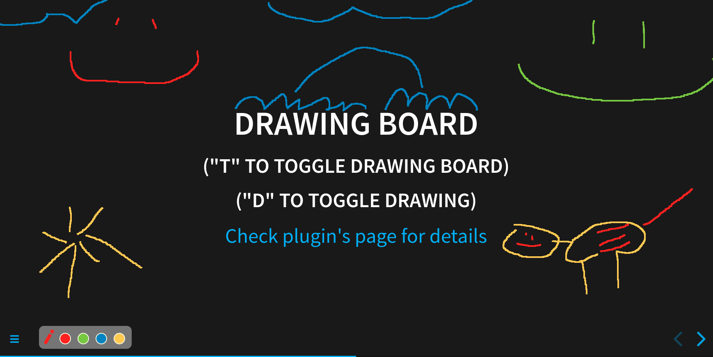
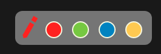
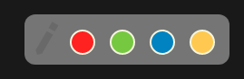

# RevealJS drawer plugin (3.2KB gzipped)

Allows you to draw over your slides. Drawings are saved per slide and kept when slide is changed. [Demo](https://burnpiro.github.io/presentation-template/#/2). Works with [RevealJS Pointer Plugin](https://github.com/burnpiro/reveal-pointer).

> This plugin only works with [RevealJS](https://revealjs.com/) `v4.x` or higher.

No external dependencies, __only 7.5KB  | <3.2KB gzipped__.



## Installation

Copy `dist/drawer.js` into `plugins/drawer/drawer.js` and import script:

```html
[...]
<script src="plugin/drawer/drawer.js"></script>
[...]
```

Copy `dist/drawer.css` into `plugins/drawer/drawer.css` and import style in `<head></head>`:

```html
[...]
<link rel="stylesheet" href="plugin/drawer/drawer.css" />
[...]
```

Add `RevealDrawer` into your plugins initialization:

```javascript
plugins: [RevealDrawer];
```

### Usage

#### Keybindings (default):

- `T` - toggle drawing board
- `D` - toggle mode (`drawing` or `not drawing`)
- `Ctrl + Z` - remove last line from current slide
- `"1", "2", "3", "4"` - change selected color (base on the order)

If you're not changing anything in the [Config](#config) then you should be able to show drawing board just by hitting `T`. By default the drawing is enabled. 



If you hit `D` then drawing mode is toggled and it is going to switch to `disabled` mode (the pen icon is grayed out).



In drawing mode you're not able to interact with other elements (like code) because it would disturb your drawing. That's why switching between drawing and not drawing mode is important.

Each time you draw sth, it is saved for this particular slide (slide includes all fragments). You can switch between slides and have a different drawing on each one. `Ctrl + Z` is available if you make a mistake in your drawing. It also works per slide even if you're coming back from the different slide.

You're able to change between colors using color icons or numbers on the keyboard. Each color has a number assigned to it and if you have 4 colors then numbers `1,2,3,4` on your keyboard are responsible for switching between them (default option). If you change default colors then numbers are assigned to new ones (base on how many colors you have). E.g. you've decided to have simpler colors, so your list looks like `['#FF0000', '#00FF00', '#0000FF']`, now only `1,2,3` keys are available. 


### Config

You can configure drawer key and tail length in plugin config.

```javascript
Reveal.initialize({
  drawer: {
    toggleDrawKey: "d", // (optional) key to enable drawing, default "d"
    toggleBoardKey: "t", // (optional) key to show drawing board, default "t"
    colors: ["#fa1e0e", "#8ac926", "#1982c4", "#ffca3a"], // (optional) list of colors avaiable (hex color codes)
    color: "#FF0000", // (optional) color of a cursor, first color from `codes` is a default
    pathSize: 4, // (optional) path size in px, default 4
  }
})
```

List of available keys:

> ["0", "1", "2", "3", "4", "5", "6", "7", "8", "9", "backspace", "tab", "enter", "shift", "ctrl", "alt", "pausebreak", "capslock", "esc", "space", "pageup", "pagedown", "end", "home", "leftarrow", "uparrow", "rightarrow", "downarrow", "insert", "delete", "a", "b", "c", "d", "e", "f", "g", "h", "i", "j", "k", "l", "m", "n", "o", "p", "q", "r", "s", "t", "u", "v", "w", "x", "y", "z", "leftwindowkey", "rightwindowkey", "selectkey", "numpad0", "numpad1", "numpad2", "numpad3", "numpad4", "numpad5", "numpad6", "numpad7", "numpad8", "numpad9", "multiply", "add", "subtract", "decimalpoint", "divide", "f1", "f2", "f3", "f4", "f5", "f6", "f7", "f8", "f9", "f10", "f11", "f12", "numlock", "scrolllock", "semicolon", "equalsign", "comma", "dash", "period", "forwardslash", "graveaccent", "openbracket", "backslash", "closebracket", "singlequote"]

## Developing

Make changes in `src/plugin.js` and run:

```bash
npm run build
```

This is going to produce `dist/drawer.js` with bundled iife file.
